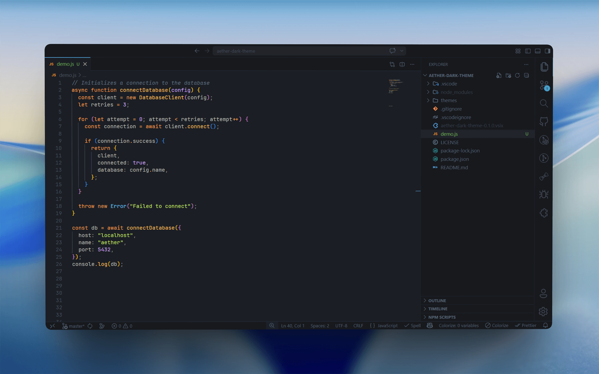

# Aether Dark

Aether Dark is a polished dark theme for Visual Studio Code.
It keeps warm, expressive syntax while using calm cyan accents across the editor UI for a clean, focused coding experience.



[Visual Studio Marketplace](https://marketplace.visualstudio.com/items?itemName=sbetav.aether-dark-theme) · [Open VSX](https://open-vsx.org/extension/sbetav/aether-dark-theme)

## Highlights

- Neutral charcoal backgrounds with balanced contrast
- Cyan/blue UI accents (focus, active indicators, badges, cursor)
- Warm, vivid syntax palette inspired by Ayu
- Softer borders and reduced visual noise

## Install

### From Visual Studio Marketplace (VS Code)

1. Open Extensions in VS Code
2. Search for `Aether Dark`
3. Click **Install**
4. Open `Preferences: Color Theme` and select **Aether Dark**

### From Open VSX

1. Open your VS Code-compatible editor extensions view
2. Search for `Aether Dark`
3. Install and activate the theme

## Marketplace Pages

- VS Code: https://marketplace.visualstudio.com/items?itemName=sbetav.aether-dark-theme
- Open VSX: https://open-vsx.org/extension/sbetav/aether-dark-theme

## Assets

- Marketplace icon: `images/icon.png` (512x512)
- Preview screenshot: `images/screenshot.png` (1920x1200)

## Development

1. Clone this repository
2. Open it in VS Code
3. Press `F5` and run `Run Theme Extension`
4. In the Extension Development Host, pick **Aether Dark**
5. Edit `themes/aether-dark.json`
6. Run `Developer: Reload Window` in the dev host to preview changes

## Publish

Set your tokens first:

- `VSCE_PAT` for Visual Studio Marketplace
- `OVSX_PAT` for Open VSX

Then run:

```bash
npm install
npm run package:vscode
npm run publish:vscode
npm run publish:openvsx
```

## Acknowledgment

Aether Dark is inspired by the excellent [Ayu Theme](https://github.com/ayu-theme/vscode-ayu) by the Ayu Theme authors.
Many palette and language-color ideas are derived from their work. Big thanks to the original creators.

## License

MIT
